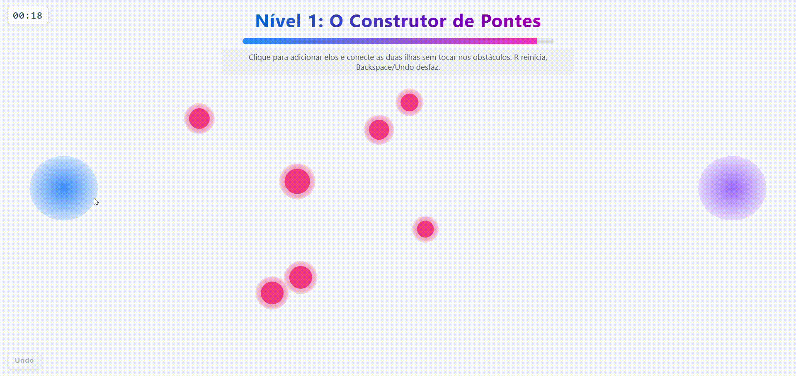
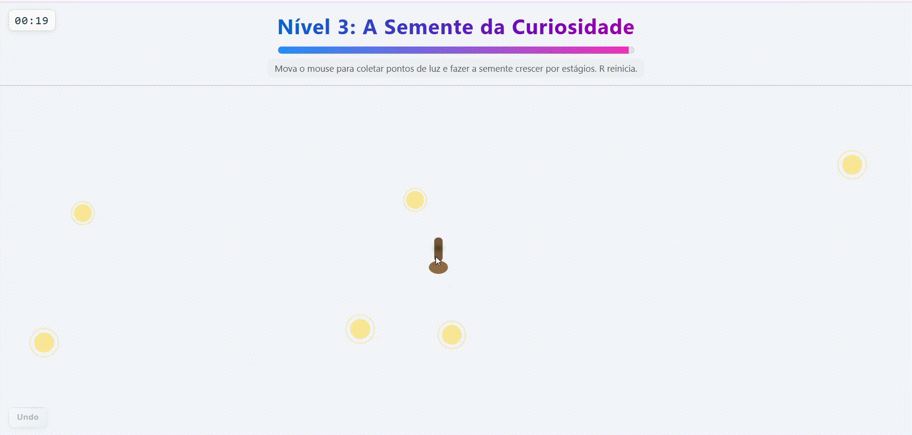

<div align="center>

# 🌟 Experiência Interativa (Processo Seletivo Apple Developer Academy UFPE)

Uma jornada em **3 mini-níveis** construídos com **p5.js**, cada um representando um aspecto da minha forma de pensar e aprender:

| Nível | Nome | Metáfora | Habilidade simbolizada |
|------|------|----------|-------------------------|
| 1 | O Construtor de Pontes | Conectar ilhas | Conectar ideias / colaboração |
| 2 | O Organizador de Ideias | Agrupar formas | Estruturar caos em clareza |
| 3 | A Semente da Curiosidade | Crescimento orgânico | Aprendizado contínuo |

[](https://p5js.org/)    [](https://creativecommons.org/licenses/by-nc-sa/4.0/deed.pt_BR)

<details>
<summary><strong>Resumo rápido (clique para expandir)</strong></summary>

Abra `index.html`, clique em Iniciar. Complete 3 minigames (cada um com 20s). `R` reinicia. `Backspace` remove último elo no Nível 1. Arraste as formas no Nível 2. No Nível 3 mova o mouse para crescer a semente.

</details>

Versão resumida para avaliadores: veja `README_SIMPLES.md`.

</div>

## 📑 Sumário
1. [Preview / Demo](#-preview--demo)
2. [Visão Geral dos Níveis](#-visão-geral-dos-níveis)
3. [Como Executar](#-como-executar)
4. [Controles por Nível](#-controles-por-nível)
5. [Mecânicas e Regras](#-mecânicas-e-regras)
6. [Timer e Dificuldade](#-timer-e-dificuldade)
7. [Arquitetura Técnica](#-arquitetura-técnica)
8. [Estrutura do Projeto](#-estrutura-do-projeto)
9. [Parametrização Rápida](#-parametrização-rápida)
10. [Roadmap](#-roadmap)
11. [Solução de Problemas](#-solução-de-problemas)
12. [Contribuindo](#-contribuindo)
13. [Licença](#-licença)
14. [Créditos](#-créditos)

## 🖼 Preview / Demo
<p align="center">
	
	
	
</p>

## 🧭 Visão Geral dos Níveis
### Nível 1 – O Construtor de Pontes
Clique para criar elos entre as duas ilhas enquanto evita que segmentos recém-criados colidam com obstáculos móveis. Ao conectar as ilhas: animação de fluxo percorre a ponte e mostra mensagem com mensagem-conceito sobre colaboração.

### Nível 2 – O Organizador de Ideias
Formas (círculo, quadrado, triângulo) flutuam suavemente. Arraste cada uma para a zona do símbolo correspondente no rodapé. Ao encaixar todas, mensagem temática sobre clareza → avança.

### Nível 3 – A Semente da Curiosidade
Uma semente segue o cursor suavemente. Colete orbes de luz: cada um avança um estágio de crescimento (folhas + estrutura visual). Ao completar todos os estágios, surge efeito de partículas e mensagem sobre aprendizado contínuo.

## 🧪 Como Executar
Opção rápida: abrir `index.html` direto no navegador (funciona na maioria dos casos).  
Opção recomendada (servidor local):

Python 3:
```bash
python -m http.server 8080
```
Node (npx):
```bash
npx serve .
```
Acesse: http://localhost:8080

## ⌨ Controles por Nível
| Nível | Ação | Entrada |
|-------|------|---------|
| 1 | Adicionar elo | Clique / Toque |
| 1 | Desfazer elo | `Backspace` / botão Undo / clicar em ponto |
| 1 | Reiniciar | `R` |
| 2 | Selecionar/arrastar forma | Clique e arraste |
| 2 | Reiniciar | `R` |
| 3 | Mover semente | Mover cursor (follow) |
| 3 | Reiniciar | `R` |
| Todos | Próximo nível (após completar) | Botão “Próxima Fase” |

## 🧬 Mecânicas e Regras
### Nível 1
- Segmentos são validados em tempo real: não pode atravessar o círculo de nenhum obstáculo.
- Obstáculos têm movimento harmônico (eixo horizontal ou vertical) com amplitude e velocidade escalonadas por dificuldade.
- Vitória: primeiro elo dentro da ilha esquerda + último dentro da direita.
- Remoção de elo ajusta dinamicamente o estado (animação some se estava concluído).

### Nível 2
- 3 tipos de formas × 3 instâncias cada = 9 peças.  
- Movimento leve (bounce) enquanto não manipuladas.  
- Encaixe correto gera efeito visual e normaliza tamanho/alinhamento.  
- Vitória: todas com flag `placed=true`.

### Nível 3
- Semente segue com easing (limite de velocidade).  
- Cada orb coleta → incrementa estágio (`seed.stage`).  
- Layout procedural de folhas e partículas adaptado ao estágio.  
- Vitória: `seed.stage >= required` → efeito de flores + halo.

## ⏱ Timer e Dificuldade
- Cada nível: 20 segundos (`levelTimeLimit`).  
- Barra de tempo animada + mudança visual em 10s finais.  
- Nível 1 escalona dificuldade: aumenta velocidade/amplitude e pode adicionar obstáculos extras até limite.  
- Estados: `completed`, `failed`, controle central via `gameStarted` e `startTime`.

## 🏗 Arquitetura Técnica
| Área | Descrição |
|------|-----------|
| Loop principal | `setup()` inicializa canvas, UI e chama `initScene()`. `draw()` ramifica comportamento por nível. |
| Sistema de Níveis | `currentLevel` (1..3) + funções específicas: `setupLevel2()`, `setupLevel3()`, `gotoNextLevel()`, `restartCurrentLevel()`. |
| Timer | Cálculo em `updateTimer()` baseado em `startTime` + `currentTimeLimit()`. Atualiza DOM (`#timer`, barra). |
| Obstáculos (N1) | Array de objetos com movimento senoidal. Escalonamento em `maybeIncreaseDifficulty()`. Colisão segmento-círculo via projeção paramétrica. |
| Ponte (N1) | Lista de vetores (`links`). Adição, remoção, verificação de conclusão, animação de fluxo (`flowParticles`). |
| Drag & Drop (N2) | Cálculo manual: hit-test por tipo de shape + zona retangular, reposicionamento em grid quando encaixada. |
| Crescimento (N3) | Estágios geram morfologia de folhas e efeitos; partículas de flores geradas proceduralmente quando completo. |
| UI / Telas | Start screen e mensagens finais montadas dinamicamente (DOM). Overlay adaptado por nível (`updateOverlayForLevel()`). |
| Constantes / Limites | `SAFE_TOP` evita sobreposição de elementos com cabeçalho. |
| Organização | Código monolítico (`sketch.js`) mas segmentado em blocos comentados. Próximo passo: modularizar. |

### Possíveis Melhorias Arquiteturais
- Extrair cada nível para um objeto/classe com interface comum: `init()`, `update(dt)`, `render()`, `handleInput()`, `isComplete()`.  
- Introduzir um gerenciador de estado (FSM simples) para telas (start, playing, success, fail).  
- Separar lógica de UI (DOM) da lógica de jogo para facilitar testes.  
- Adicionar testes unitários (ex.: colisão segmento-círculo).  

## 🗂 Estrutura do Projeto
```
index.html    # markup + inclusão p5 + telas dinâmicas
style.css     # estética, layout responsivo, animações leves
sketch.js     # toda a lógica dos 3 níveis (estado, render, input)
conceito.txt  # (opcional) ideia conceitual original
README.md     # documento completo
README_SIMPLES.md # versão curta p/ avaliadores
```

## 🛠 Parametrização Rápida
| Objetivo | Onde | Notas |
|----------|------|-------|
| Tempo por nível | objeto `levelTimeLimit` | Ajustar ms individualmente |
| Obstáculos base (N1) | `baseObstacleCount` | Aumenta desafio inicial |
| Intervalo escalar dif. (N1) | `difficultyInterval` | Em ms (8s padrão) |
| Máx. extras (N1) | `maxExtraObstacles` | Limite de novos obstáculos |
| Raio ilhas (N1) | variável `r` em `initScene()` | Afeta tolerância de ancoragem |
| Formas (N2) | `level2Types`, `level2PerType` | Ajusta diversidade |
| Orbs (N3) | `level3Required` | Número de estágios de crescimento |
| Linha segura | `SAFE_TOP` | Margem para overlay |

## 🧭 Roadmap
Itens planejados / ideias futuras:
- [ ] Sons sutis (hover, encaixe, coleta, vitória, falha)
- [ ] Persistência simples (localStorage) para tempo restante ou melhor tempo
- [ ] Acessibilidade: modo alto contraste / redução de animação
- [ ] Opção de dificuldade escalável manual (fácil / médio / intenso)
- [ ] Modularização em múltiplos arquivos JS
- [ ] Testes de colisão automatizados
- [ ] Exportar replay do nível 1 (sequência de pontos)
- [ ] Efeito sonoro paramétrico gerado via WebAudio
- [ ] Mobile refinements (haptic feedback leve)

## 🧩 Solução de Problemas
| Sintoma | Possível causa | Ação |
|---------|----------------|------|
| Canvas não carrega | CDN p5 bloqueada | Ver Console / rede; usar offline local |
| Nada reage ao clicar | Jogo não iniciado | Clicar em “Iniciar” (tela inicial) |
| Undo não funciona | Nível errado / sem elos | Apenas Nível 1 e com ao menos 1 elo |
| Timer congela | Erro JS interrompeu loop | Ver Console (F12) |
| Sem internet | CDN indisponível | Baixar `p5.min.js` local e alterar `<script>` |

Offline: baixe `p5.min.js` e troque no `index.html`:
```html
<script src="libs/p5.min.js"></script>
```

## 🤝 Contribuindo
1. Fork
2. Branch: `feat/nome-da-feature`
3. Commit semântico: `feat: adiciona …` / `fix: corrige …`
4. Push & PR com descrição + (se possível) gif curto

## 📜 Licença
Distribuído sob **Creative Commons Atribuição-NãoComercial-CompartilhaIgual 4.0 (CC BY-NC-SA 4.0)**.  
Você pode compartilhar e adaptar com atribuição, sem uso comercial e mantendo a mesma licença.  
Veja: [`LICENSE`](LICENSE) • [Resumo oficial](https://creativecommons.org/licenses/by-nc-sa/4.0/deed.pt_BR)

## 🙌 Créditos
- Desenvolvido com [p5.js](https://p5js.org/) ♥
- Conceito narrativo e código: autoria própria
- Inspirado em metáforas de conexão, organização e crescimento

---

Se esta experiência te agradou, uma ⭐ ajuda muito. Obrigada por jogar! 🌱
